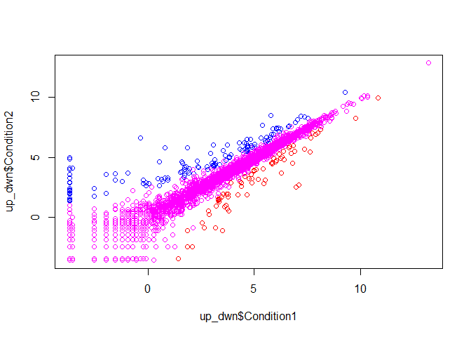

#Plotting plots


```r
x <-rnorm(1000,0)

mean(x)
```

```
## [1] -0.02458993
```

```r
sd(x)
```

```
## [1] 1.026516
```

```r
#summary() gives the Min/Max, 1st/3rd Quartile, Median, and Mean
summary(x)
```

```
##     Min.  1st Qu.   Median     Mean  3rd Qu.     Max. 
## -3.60183 -0.69587 -0.03711 -0.02459  0.67802  3.18392
```

```r
#boxplots are essenntially the graphed summary stats
boxplot(x)
```

<!-- -->


```r
hist(x)
```

<!-- -->

###Practicing Plotting

##Practice Line plot


```r
#read.table() reads .txt files into tables and
#takes a relative OR absolute file path as a string.
#If the first line of the .txt is the name of the columns, set "header = TRUE"
weight <- read.table("bggn213_05_rstats/weight_chart.txt", header = TRUE)

plot(weight, type = "b", pch = 15, cex = 1.5, lwd = 2, ylim = c(2,10), xlab = "Age (Months)", ylab = "Weight (kg.)", main = "Infant Weight by Month")
```

<!-- -->

```r
##Practicing Bar plot
mouse_feature <- read.table("bggn213_05_rstats/feature_counts.txt", header = TRUE, sep = "\t")

#change the global parameters for par() which are the graphical properties
par(mar = c(5, 11, 4, 2))
barplot(mouse_feature$Count, horiz = TRUE, names.arg = mouse_feature$Feature, las = 1, main = "GRCm38 Genome Features")
```

<!-- -->

```r
#dev.off()

#The mfrow parameter allows us to have multiple plots
#par(mfrow = c(2,1))
#plot(1:5)
#plot(5:1)
#dev.off()
```


##Adjusting color

```r
#read.delim() sets header = TRUE and sep = "\t"
fly_sex <- read.delim("bggn213_05_rstats/male_female_counts.txt")


barplot(fly_sex$Count, col=rainbow(nrow(fly_sex)))
```

<!-- -->

```r
barplot(fly_sex$Count, col=c("blue","red"))
```

<!-- -->


##Exercise 2B

```r
up_dwn <- read.delim("bggn213_05_rstats/up_down_expression.txt")

palette(c("red", "magenta","blue"))
plot(up_dwn$Condition1, up_dwn$Condition2, col=up_dwn$State)
```

<!-- -->

```r
#How to tell how many genes are going Up, Down, or are Unchanging?
#The info is stored in the State column of the table, so... table the column!
table(up_dwn$State)
```

```
## 
##       down unchanging         up 
##         72       4997        127
```


##Exercise 2C
