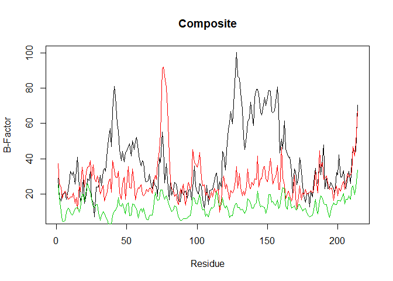
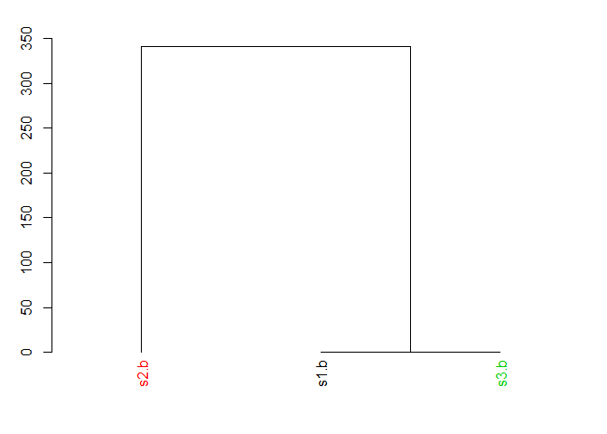

  


```r
# Can you improve this analysis code?
library(bio3d)
s1 <- read.pdb("4AKE") # kinase with drug
```

```
##   Note: Accessing on-line PDB file
```

```r
s2 <- read.pdb("1AKE") # kinase no drug
```

```
##   Note: Accessing on-line PDB file
##    PDB has ALT records, taking A only, rm.alt=TRUE
```

```r
s3 <- read.pdb("1E4Y") # kinase with drug
```

```
##   Note: Accessing on-line PDB file
```

```r
s1.chainA <- trim.pdb(s1, chain="A", elety="CA")
s2.chainA <- trim.pdb(s2, chain="A", elety="CA")
s3.chainA <- trim.pdb(s1, chain="A", elety="CA")

s1.b <- s1.chainA$atom$b
s2.b <- s2.chainA$atom$b
s3.b <- s3.chainA$atom$b

plotb3(s1.b, sse=s1.chainA, typ="l", ylab="Bfactor")
```

<!-- -->

```r
plotb3(s2.b, sse=s2.chainA, typ="l", ylab="Bfactor")
```

<!-- -->

```r
plotb3(s3.b, sse=s3.chainA, typ="l", ylab="Bfactor")
```

<!-- -->

Code snippet of main workflow

```r
library(bio3d)
#Input:
s1 <- read.pdb("4AKE")
```

```
##   Note: Accessing on-line PDB file
```

```
## Warning in get.pdb(file, path = tempdir(), verbose = FALSE): C:\Users\gary_
## \AppData\Local\Temp\RtmpOU6R0i/4AKE.pdb exists. Skipping download
```

```r
#Manipulating Input:
s1.chainA <- trim.pdb(s1, chain="A", elety="CA")
s1.b <- s1.chainA$atom$b

#Output:
plotb3(s1.b, sse=s1.chainA, typ="l", ylab="Bfactor")
```

<!-- -->


Function of above code v1

```r
library(bio3d)

graph_protein <- function(accession) {
  #Purpose:
  #  Graphs the B-Factor of each Alpha-Carbon (CA) of a protein with Secondary Structure  
  #  overlayed.
  #  B-Factor is the uncertainty of protein atom position in X-ray crystallography i.e. how    #  much the position of the protein wiggles.
  
  #Inputs:
  #  accession: Takes the PDB accession number of a protein
  
  #Outputs:
  #  Plots the CA position vs. B-Factor of protein w/ sse
  
  s <- read.pdb(accession)
  
  #Trim the large PDB object and limits to alpha-carbons of Chain A
  s.chainA <- trim.pdb(s, chain="A", elety="CA")
  
  #Access the B-factors of each alpha-carbon
  s.b <- s.chainA$atom$b
  
  #Plot the B-factor against the Secondary Structure Element (SSE) of Chain A
  plotb3(s.b, sse=s.chainA, typ="l", ylab="Bfactor")
  
}
```

Testing function v1 to see if output matches the code snippet.

Obesrvation: Function has similar output to single accession.

```r
graph_protein("4AKE")
```

```
##   Note: Accessing on-line PDB file
```

```
## Warning in get.pdb(file, path = tempdir(), verbose = FALSE): C:\Users\gary_
## \AppData\Local\Temp\RtmpOU6R0i/4AKE.pdb exists. Skipping download
```

<!-- -->

Testing function on a vector of inputs
Errors: Cannot take input vector of length > 1. i.e. Function is not vectorized.

```r
#graph_protein(c("4AKE","1AKE","1E4Y"))
```

Vectorize function by including for loop
Success! Output matches original, redundant code.

```r
#Goal
#graph_multi_prot <- function(){blah}

test_array <- c("4AKE","1AKE","1E4Y")

for (protein in test_array) {
  graph_protein(protein)
}
```

```
##   Note: Accessing on-line PDB file
```

```
## Warning in get.pdb(file, path = tempdir(), verbose = FALSE): C:\Users\gary_
## \AppData\Local\Temp\RtmpOU6R0i/4AKE.pdb exists. Skipping download
```

```
##   Note: Accessing on-line PDB file
```

```
## Warning in get.pdb(file, path = tempdir(), verbose = FALSE): C:\Users\gary_
## \AppData\Local\Temp\RtmpOU6R0i/1AKE.pdb exists. Skipping download
```

<!-- -->

```
##    PDB has ALT records, taking A only, rm.alt=TRUE
```

```
##   Note: Accessing on-line PDB file
```

```
## Warning in get.pdb(file, path = tempdir(), verbose = FALSE): C:\Users\gary_
## \AppData\Local\Temp\RtmpOU6R0i/1E4Y.pdb exists. Skipping download
```

<!-- --><!-- -->

Vectorized Bfactor Graph function V1

```r
bfactor_prot_graph <- function(accession_vectors) {
  #Purpose:
  #  Graph Residue Bfactors of multiple proteins
  
  #Inputs:
  #  accession_vector = vector of stringified PDB accession IDs
  
  for (protein in accession_vectors) {
    graph_protein(protein)
  }
}
```


Better atomization of functions for increased modularity

```r
get_bfactor <- function(accession) {
  #Purpose:
  #  Return the bfactor for each residue of a PDB accession ID
  
  #Inputs:
  #  accession: Takes the PDC accession number of a protein
  
  #Outputs:
  #  Vector of B-Factor of each protein residue stored at its corresponding index
  
  #Reading PDB accession ID to retrieve data.
  s <- read.pdb(accession)
  
  #Trim the large PDB object and limits to alpha-carbons of Chain A
  s.chainA <- trim.pdb(s, chain="A", elety="CA")
  
  #Access the B-factors of each alpha-carbon
  s.b <- s.chainA$atom$b
  
  return(s.b)
}
```

Testing new function. Note: not vectorized

```r
get_bfactor("4AKE")
```

```
##   Note: Accessing on-line PDB file
```

```
## Warning in get.pdb(file, path = tempdir(), verbose = FALSE): C:\Users\gary_
## \AppData\Local\Temp\RtmpOU6R0i/4AKE.pdb exists. Skipping download
```

```
##   [1]  29.02  18.44  16.20  19.67  20.26  20.55  17.05  22.13  26.71  33.05
##  [11]  30.66  32.73  25.61  33.19  41.03  24.09  16.18  19.14  29.19  14.79
##  [21]  19.63  28.54  27.49  32.56  17.13  15.50   6.98  24.07  24.00  23.94
##  [31]  30.70  24.70  32.84  34.60  33.01  44.60  50.74  57.32  47.04  67.13
##  [41]  81.04  75.20  59.68  55.63  45.12  39.04  44.31  38.21  43.70  44.19
##  [51]  47.00  48.67  41.54  50.22  45.07  49.77  52.04  44.82  39.75  35.79
##  [61]  38.92  37.93  27.18  26.86  27.53  31.16  27.08  23.03  28.12  24.78
##  [71]  24.22  18.69  40.67  38.08  55.26  46.29  26.25  37.14  27.50  16.86
##  [81]  27.76  19.27  22.22  26.70  25.52  21.22  15.90  15.84  22.44  19.61
##  [91]  21.23  21.79  17.64  22.19  22.73  16.80  23.25  35.95  24.42  20.96
## [101]  20.00  25.99  24.39  17.19  12.16  17.35  24.97  14.08  22.01  22.26
## [111]  22.78  27.47  30.49  32.02  20.90  27.03  23.84  44.37  42.47  33.48
## [121]  44.56  56.67  60.18  66.62  59.95  70.81  88.63 100.11  86.60  85.80
## [131]  77.48  68.13  52.66  45.34  52.43  60.90  62.64  72.19  66.75  58.73
## [141]  74.57  79.29  79.53  76.58  66.40  64.76  70.48  74.84  70.11  74.82
## [151]  78.61  78.24  66.70  66.10  67.01  72.28  80.64  68.54  43.23  51.24
## [161]  45.72  61.60  45.61  42.57  41.03  41.02  33.34  19.48  34.38  33.11
## [171]  25.48  29.68  40.71  32.91  24.41  19.20  15.43  19.93  20.66  12.72
## [181]  21.40  18.21  26.68  34.50  25.77  26.52  36.85  31.05  39.84  48.03
## [191]  23.04  29.57  23.00  23.80  26.59  25.49  23.25  19.89  32.37  30.97
## [201]  42.16  29.64  29.69  33.15  26.38  23.17  29.35  32.80  25.92  38.01
## [211]  45.95  44.26  44.35  70.26
```

```r
get_bfactor("1AKE")
```

```
##   Note: Accessing on-line PDB file
```

```
## Warning in get.pdb(file, path = tempdir(), verbose = FALSE): C:\Users\gary_
## \AppData\Local\Temp\RtmpOU6R0i/1AKE.pdb exists. Skipping download
```

```
##    PDB has ALT records, taking A only, rm.alt=TRUE
```

```
##   [1] 37.14 25.76 23.90 17.83 19.86 21.75 20.21 16.92 17.47 18.35 18.31
##  [12] 20.57 14.56 17.87 11.87 24.63 21.29 35.13 29.68 23.96 32.34 35.34
##  [23] 35.64 38.91 29.00 36.55 28.83 27.15 30.28 28.13 19.90 21.95 25.07
##  [34] 16.15 18.35 21.19 27.13 28.55 21.10 38.88 33.63 29.51 29.21 33.01
##  [45] 20.92 17.17 25.84 29.80 16.89 24.66 35.62 23.52 23.37 34.41 25.96
##  [56] 16.79 20.20 23.72 23.29 25.23 19.81 19.00 20.21 22.62 21.40 23.47
##  [67] 23.20 20.21 25.90 30.58 28.25 37.60 44.66 54.46 91.10 92.02 86.85
##  [78] 80.21 68.72 42.01 27.69 23.06 21.98 18.60 20.17 15.06 14.20 23.07
##  [89] 20.36 25.76 17.02 13.71 23.88 26.72 22.58 24.51 45.23 38.07 36.97
## [100] 35.17 37.83 43.69 29.14 24.56 25.20 19.27 20.88 18.27 16.96 21.38
## [111] 18.33 23.18 21.15 21.97 22.63  9.74 16.71 26.18 30.39 22.95 25.51
## [122] 20.28 16.86 21.94 20.59 21.64 27.42 35.72 23.47 31.57 23.71 19.01
## [133] 21.52 19.40 24.32 34.28 23.96 23.14 26.60 24.94 28.49 28.18 41.64
## [144] 23.85 28.67 28.76 35.16 35.46 28.74 26.99 31.74 40.41 33.73 25.57
## [155] 29.13 29.74 36.32 22.58 22.82 46.67 29.44 25.40 17.27 20.38 21.55
## [166] 19.19 15.89 18.37 30.51 18.47 11.70 18.45 24.75 16.63 20.80 19.62
## [177] 22.56 19.87 20.22 21.16 22.13 20.66 22.82 32.86 26.04 20.60 44.44
## [188] 35.28 38.03 28.46 29.10 30.19 26.17 22.71 23.39 23.44 16.27 21.26
## [199] 24.67 19.12 23.26 21.75 24.59 27.26 22.63 26.40 31.60 29.57 30.90
## [210] 32.29 46.86 41.73 49.31 66.76
```


Graphing Protein v2 with more descriptive name

```r
graph_bfactor <- function(accession) {
  #Purpose:
  #  Graphs the B-Factor of each Alpha-Carbon (CA) of a protein with Secondary Structure  
  #  overlayed.
  #  B-Factor is the uncertainty of protein atom position in X-ray crystallography i.e. how    #  much the position of the protein wiggles.
  
  #Inputs:
  #  accession: Takes the PDC accession number of a protein
  
  #Outputs:
  #  Plots the CA position vs. B-Factor of protein w/ sse
  
  #Getting B-factors of each residue
  get_bfactor(accession = accession)
  
  #Plot the B-factor of each residue with the Secondary Structure Element (SSE) of Chain A
  plotb3(s.b, sse=s.chainA, typ="l", ylab="Bfactor")
  
}
```

Testing ways to iterate through a vector of B-Factors

```r
  for (protein in 2:length(test_array)) {
    get_bfactor(test_array[protein])
  }
```

```
##   Note: Accessing on-line PDB file
```

```
## Warning in get.pdb(file, path = tempdir(), verbose = FALSE): C:\Users\gary_
## \AppData\Local\Temp\RtmpOU6R0i/1AKE.pdb exists. Skipping download
```

```
##    PDB has ALT records, taking A only, rm.alt=TRUE
##   Note: Accessing on-line PDB file
```

```
## Warning in get.pdb(file, path = tempdir(), verbose = FALSE): C:\Users\gary_
## \AppData\Local\Temp\RtmpOU6R0i/1E4Y.pdb exists. Skipping download
```


Modifying the above function to improve datahandling.

```r
bfactor_prot_graph2 <- function(accession_vectors,
                                individ.plot = TRUE) {
  #Purpose:
  #  Graph Residue Bfactors of multiple proteins
  
  #Inputs:
  #  accession_vectors = vector of stringified PDB accession IDs
  #  individ.plot = Boolean that graphs individual graphs of each protein

  #Outputs:
  #  Composite plot of the B-factor of each residue of all proteins listed in   
  #  accession_vectors
  #   
  #  Individual plots of the B-Factor of each residue for all proteins in accession_vectors
  
  #Graph the B-factor of the 1st PDB accession ID to initialize the plot
  s0 <- get_bfactor(accession_vectors[1])
  plot(s0, typ='l', xlab = "Residue", ylab = "B-Factor", main = "Composite")
  
  #Determining remaining lines to be plotted
  remaining <- length(accession_vectors)
  
  #Add the subsequent lines
  for (protein in 2:remaining) {
    s <- get_bfactor(accession_vectors[protein])
    lines(s, typ='l', col = c(protein))
  } #end of adding lines
  
  ##Graphing individual plots
  if(individ.plot){
    for (protein in accession_vectors) {
      graph_protein(protein)
    }
  } #end of individual plots
} #end of function
```


```r
bfactor_prot_graph2(test_array)
```

```
##   Note: Accessing on-line PDB file
```

```
## Warning in get.pdb(file, path = tempdir(), verbose = FALSE): C:\Users\gary_
## \AppData\Local\Temp\RtmpOU6R0i/4AKE.pdb exists. Skipping download
```

```
##   Note: Accessing on-line PDB file
```

```
## Warning in get.pdb(file, path = tempdir(), verbose = FALSE): C:\Users\gary_
## \AppData\Local\Temp\RtmpOU6R0i/1AKE.pdb exists. Skipping download
```

```
##    PDB has ALT records, taking A only, rm.alt=TRUE
##   Note: Accessing on-line PDB file
```

```
## Warning in get.pdb(file, path = tempdir(), verbose = FALSE): C:\Users\gary_
## \AppData\Local\Temp\RtmpOU6R0i/1E4Y.pdb exists. Skipping download
```

```
##   Note: Accessing on-line PDB file
```

```
## Warning in get.pdb(file, path = tempdir(), verbose = FALSE): C:\Users\gary_
## \AppData\Local\Temp\RtmpOU6R0i/4AKE.pdb exists. Skipping download
```

<!-- -->

```
##   Note: Accessing on-line PDB file
```

```
## Warning in get.pdb(file, path = tempdir(), verbose = FALSE): C:\Users\gary_
## \AppData\Local\Temp\RtmpOU6R0i/1AKE.pdb exists. Skipping download
```

<!-- -->

```
##    PDB has ALT records, taking A only, rm.alt=TRUE
```

```
##   Note: Accessing on-line PDB file
```

```
## Warning in get.pdb(file, path = tempdir(), verbose = FALSE): C:\Users\gary_
## \AppData\Local\Temp\RtmpOU6R0i/1E4Y.pdb exists. Skipping download
```

<!-- --><!-- -->


### Homework: Other ways to compare B-Factor of Protein Residues

Useful functions:

```r
#hclust() gives a graphable object that returns a hierarchical structure of deviations between objects

#dist() computes a distance matrix between rows of a data matrix i.e. how different is one residue of one protein to the same # residue of another protein

#rbind() ol' reliable. Binds the rows of multiple matrices together. In this case, makes the different protein residues comparable
```

Hardcode test:

```r
hc <- hclust( dist( rbind(s1.b, s2.b, s3.b) ) )
plot(hc)
```

<!-- -->

Hardcode test #2

```r
# hc2 <- hclust( dist( rbind(s1.b, s2.b) ) )
# plot(hc2)
```
hclust needs 3 objects for comparison, rows in this case.

Results of dendogram show that S1 and s3 are most similar in their Bfactor trends which is to be expected. s1 and s3 are both +drug while s2 is -drug.

Try same results with hclustplot() bio3d function

```r
hc <- hclust( dist( rbind(s1.b, s2.b, s3.b) ) )

#Changes the label of each index to be the accession ID rather than variable
#hc$labels <- test_array

#hclustplot(hc)  doesn't work. Missing a k that needs to be btwn 1-3?

hclustplot(hc,3,hc$height) #plots with 3 colors
```

<!-- -->
Continue to troubleshoot. The hclustplot() doesn't have the same heights as the plot(hc).
