##K-mean

```r
# Generate some example data for clustering

#generate a random collection of xy points from a normal distribution
tmp <- c(rnorm(30,-3), rnorm(30,3))

#creates a group of two clusters, with the 2nd cluster being the inverted points
x <- cbind(x=tmp, y=rev(tmp))
plot(x)
```

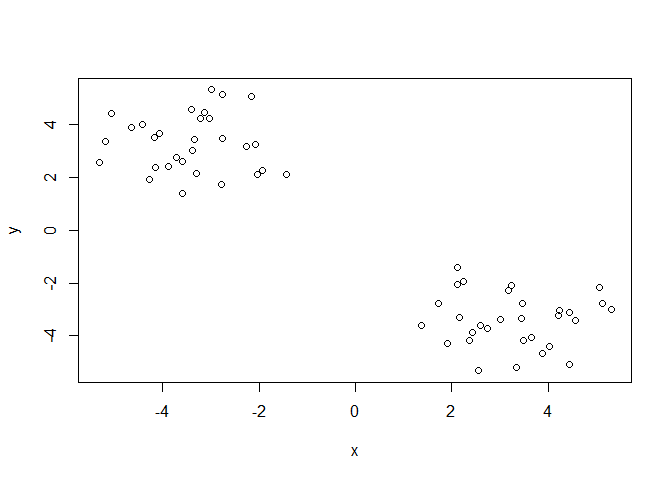<!-- -->
Visual inspection shows that there are 2 clusters w/ ~30 points per cluster.


```r
km <- kmeans(x, centers = 2, nstart = 20)
km
```

```
## K-means clustering with 2 clusters of sizes 30, 30
## 
## Cluster means:
##           x         y
## 1 -3.407174  3.279203
## 2  3.279203 -3.407174
## 
## Clustering vector:
##  [1] 1 1 1 1 1 1 1 1 1 1 1 1 1 1 1 1 1 1 1 1 1 1 1 1 1 1 1 1 1 1 2 2 2 2 2
## [36] 2 2 2 2 2 2 2 2 2 2 2 2 2 2 2 2 2 2 2 2 2 2 2 2 2
## 
## Within cluster sum of squares by cluster:
## [1] 62.89505 62.89505
##  (between_SS / total_SS =  91.4 %)
## 
## Available components:
## 
## [1] "cluster"      "centers"      "totss"        "withinss"    
## [5] "tot.withinss" "betweenss"    "size"         "iter"        
## [9] "ifault"
```

Inspect/print the results
Q. How many points are in each cluster?

```r
km$size
```

```
## [1] 30 30
```

Q. What ‘component’ of your result object details
 - cluster size?

```r
km$size
```

```
## [1] 30 30
```
 
 - cluster assignment/membership?

```r
km$cluster
```

```
##  [1] 1 1 1 1 1 1 1 1 1 1 1 1 1 1 1 1 1 1 1 1 1 1 1 1 1 1 1 1 1 1 2 2 2 2 2
## [36] 2 2 2 2 2 2 2 2 2 2 2 2 2 2 2 2 2 2 2 2 2 2 2 2 2
```
 
 - cluster center?

```r
km$centers
```

```
##           x         y
## 1 -3.407174  3.279203
## 2  3.279203 -3.407174
```


Plot x colored by the kmeans cluster assignment and
 add cluster centers as blue points

```r
plot(x, col = km$cluster, pch = 16)
points(km$centers, col = "blue", pch = 18)
```

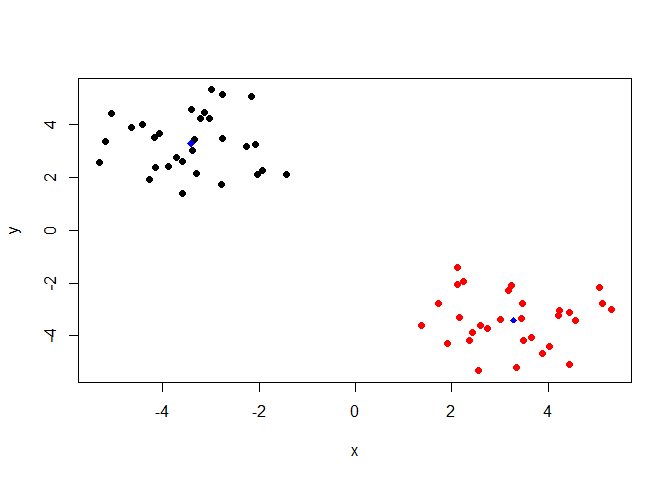<!-- -->
 
## Hierarchical Clustering

To start, we need to calculate point (dis)similarities. For now, we're using Euclidean Distance (sqrt(SS))

```r
#Cannot be viewed b/c distributions are not dataframes
dist_matrix <- dist(x)

#If we check the class of dist_matrix
is.matrix(dist_matrix) #Returns false
```

```
## [1] FALSE
```

```r
class(dist_matrix)
```

```
## [1] "dist"
```

```r
#View(as.matrix(dist_matrix))

#We can view the dimensions of the distribution by forcing it into a matrix
dim(as.matrix(dist_matrix))
```

```
## [1] 60 60
```

Hierarcical Clustering of the matrix

```r
hc <- hclust(d = dist_matrix)
```

How to view the clustering?

```r
#printing out the result isn't very useful
hc
```

```
## 
## Call:
## hclust(d = dist_matrix)
## 
## Cluster method   : complete 
## Distance         : euclidean 
## Number of objects: 60
```

```r
class(hc) #it'sits own class
```

```
## [1] "hclust"
```

Plotting a h-cluster returns a tree (dendrogram)

```r
plot(hc)
```

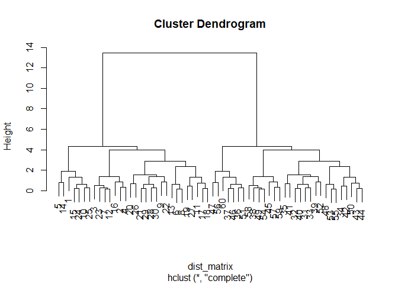<!-- -->

###Cutting the Dendrogram at different heights will determin how many clusters there are


```r
#Visual plot of cutting the tree at h = 6 produces two clusters
plot(hc)
abline(h = 6, col = "red")
```

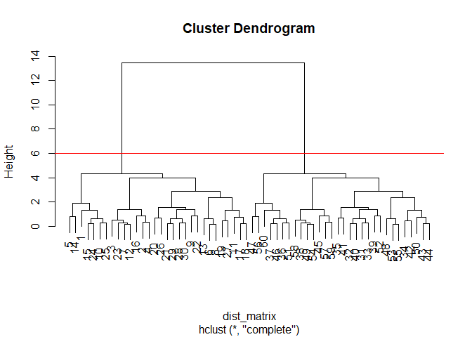<!-- -->

Cutting the tree into groups

```r
#Cut tree can be given 2 types of values: 
#  h = what height to cut the tree
#  k = how many clusters to cut the tree
grps <- cutree(hc, h = 6)
table(grps)
```

```
## grps
##  1  2 
## 30 30
```

Plotting the original data X with colored groups now

```r
plot(x, col = grps)
```

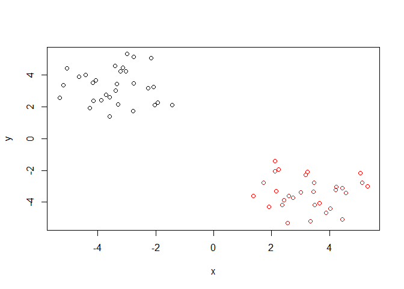<!-- -->

Plots of X with different clusters

```r
#4 clusters
plot(x, col = cutree(hc, k = 4))
```

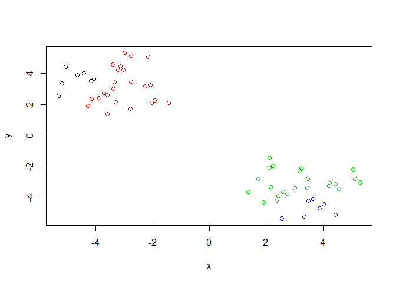<!-- -->


```r
#6 clusters
plot(x, col = cutree(hc, k = 6))
```

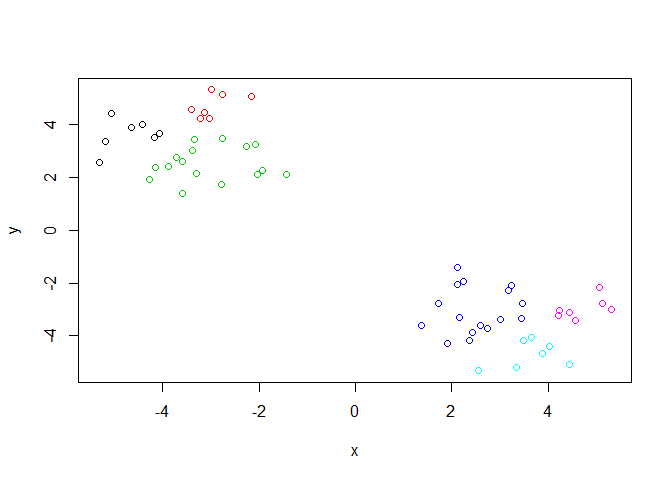<!-- -->

### More hierarchical clustering practice

```r
# Step 1. Generate some example data for clustering
x <- rbind(
 matrix(rnorm(100, mean=0, sd = 0.3), ncol = 2), # c1
 matrix(rnorm(100, mean = 1, sd = 0.3), ncol = 2), # c2
 matrix(c(rnorm(50, mean = 1, sd = 0.3), # c3
 rnorm(50, mean = 0, sd = 0.3)), ncol = 2))
colnames(x) <- c("x", "y")

# Step 2. Plot the data without clustering
plot(x)
```

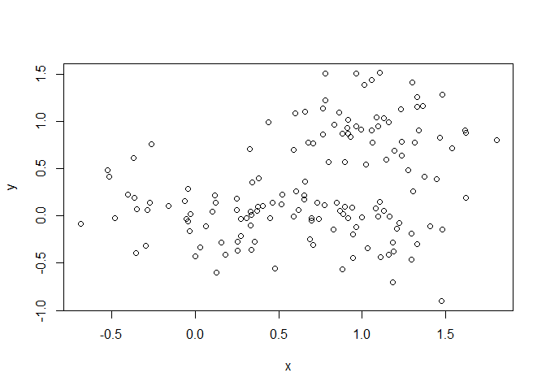<!-- -->

```r
# Step 3. Generate colors for known clusters
# (just so we can compare to hclust results)
col <- as.factor( rep(c("c1","c2","c3"), each=50) )
plot(x, col=col)
```

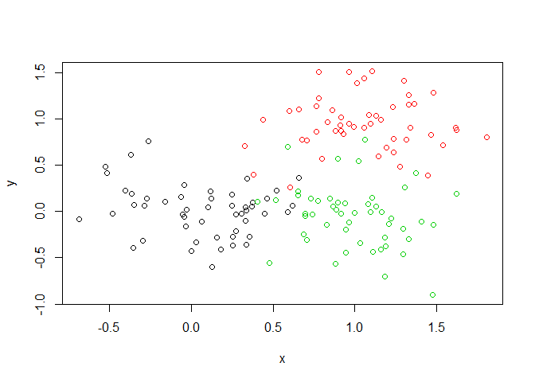<!-- -->

Q. Use the dist(), hclust(), plot() and cutree()
 functions to return 2 and 3 clusters

```r
#Create distance matrix
dist_ex <- dist(x)

#Cluster with the complete method
hc_ex <- hclust(dist_ex)

#Initial plot
plot(hc_ex)
```

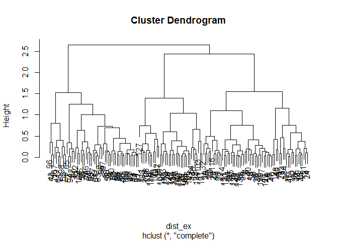<!-- -->
Cutting tree and plotting original data

```r
#2 clusters
plot(x, col = cutree(hc_ex, k = 2))
```

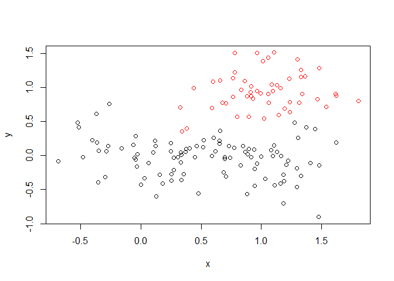<!-- -->


```r
#3 clusters
plot(x, col = cutree(hc_ex, k = 3))
```

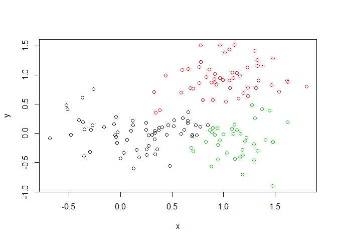<!-- -->

Q. How does this compare to your known 'col' groups?

```r
#The h-clustering doesn't match what we know of the data. Clusters don't overlap.

#True Plot
plot(x, col = col)
```

<!-- -->

```r
#HC Plot with 3 clusters. The clusters now have vastly diff sizes.
plot(x, col = cutree(hc_ex, k = 3))
```

<!-- -->

```r
table(cutree(hc_ex, k = 3)) #showing number of points in each group
```

```
## 
##  1  2  3 
## 61 52 37
```

## Principal Component Analysis


```r
## You can also download this file from the class website!
mydata <- read.csv("https://tinyurl.com/expression-CSV",
  row.names=1)

head(mydata) 
```

```
##        wt1 wt2  wt3  wt4 wt5 ko1 ko2 ko3 ko4 ko5
## gene1  439 458  408  429 420  90  88  86  90  93
## gene2  219 200  204  210 187 427 423 434 433 426
## gene3 1006 989 1030 1017 973 252 237 238 226 210
## gene4  783 792  829  856 760 849 856 835 885 894
## gene5  181 249  204  244 225 277 305 272 270 279
## gene6  460 502  491  491 493 612 594 577 618 638
```

To use prcomp() we need to have observations as rows, so flip the matrix

```r
#Use the function t() for transpose

#scale normalizes data
pca <- prcomp(t(mydata), scale = TRUE)


#Great! so what's in pca?
attributes(pca)
```

```
## $names
## [1] "sdev"     "rotation" "center"   "scale"    "x"       
## 
## $class
## [1] "prcomp"
```

The Principal Components are stored as columns in "x"

```r
## A basic PC1 vs PC2 2-D plot
plot(pca$x[,1], pca$x[,2]) 
```

<!-- -->

To see how much variance each PC captures, we have to do a little work. prcomp() returns the standard of deviation which is the square root of variance so...

```r
#computing variance matrix
pca.var <- pca$sdev^2

#computing vector for variance of each PC
pca.var.per <-  round(pca.var
                      /sum(pca.var)*100, 1)

pca.var.per
```

```
##  [1] 92.6  2.3  1.1  1.1  0.8  0.7  0.6  0.4  0.4  0.0
```

Make a scree plot for the PCs' variance

```r
#scree
barplot(pca.var.per, main="Scree Plot",
 xlab="Principal Component", ylab="Percent Variation")
```

<!-- -->


```r
#Separates the columns into two clusters by the first two characters in the column names
as.factor( substr(colnames(mydata),1,2))
```

```
##  [1] wt wt wt wt wt ko ko ko ko ko
## Levels: ko wt
```

```r
## A vector of colors for wt and ko samples
colvec <- as.factor( substr( colnames(mydata), 1, 2) )
plot(pca$x[,1], pca$x[,2], col=colvec, pch=16,
  xlab=paste0("PC1 (", pca.var.per[1], "%)"),
  ylab=paste0("PC2 (", pca.var.per[2], "%)")) 
```

<!-- -->

### Hands-on example

Input new data

```r
#Load in data
uk.data <- read.csv("https://bioboot.github.io/bggn213_S18/class-material/UK_foods.csv")

#csv has a first column of names so...

#Set the row names to the entries in column 1 as it should
rownames(uk.data) <- uk.data[,1]

#remove the first column from the dataset by...
uk.data <- uk.data[,-1]
```

Insert a nice table into our knitted HTML document by...


```r
knitr::kable(uk.data, caption="The full UK foods data table")
```


Table: The full UK foods data table

                      England   Wales   Scotland   N.Ireland
-------------------  --------  ------  ---------  ----------
Cheese                    105     103        103          66
Carcass_meat              245     227        242         267
Other_meat                685     803        750         586
Fish                      147     160        122          93
Fats_and_oils             193     235        184         209
Sugars                    156     175        147         139
Fresh_potatoes            720     874        566        1033
Fresh_Veg                 253     265        171         143
Other_Veg                 488     570        418         355
Processed_potatoes        198     203        220         187
Processed_Veg             360     365        337         334
Fresh_fruit              1102    1137        957         674
Cereals                  1472    1582       1462        1494
Beverages                  57      73         53          47
Soft_drinks              1374    1256       1572        1506
Alcoholic_drinks          375     475        458         135
Confectionery              54      64         62          41

Heatmap of the data

```r
#par(mar=c(20, 4, 4, 2))
#turn the data frame into a simple matrix
heatmap(as.matrix(uk.data))
```

<!-- -->
No strong pattern emerges from this arrangement of the heat map

PCA analysis of the food data

```r
uk.pca <- prcomp(t(uk.data), scale = FALSE)

summary(uk.pca)
```

```
## Importance of components:
##                             PC1      PC2      PC3       PC4
## Standard deviation     324.1502 212.7478 73.87622 4.189e-14
## Proportion of Variance   0.6744   0.2905  0.03503 0.000e+00
## Cumulative Proportion    0.6744   0.9650  1.00000 1.000e+00
```

Finding Percent Variance of the PCs

```r
uk.pca.var <- uk.pca$sdev^2

uk.pca.var.per <-  round(uk.pca.var/
                           sum(uk.pca.var)*100,1)
uk.pca.var.per
```

```
## [1] 67.4 29.1  3.5  0.0
```

Scree Plot of PCs

```r
barplot(uk.pca.var.per, xlab = "Principal Component", ylab = "Percent Variance (%)", main = "Scree Plot")
```

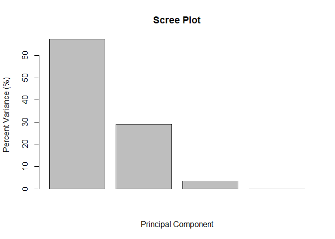<!-- -->

Plotting the PCA

```r
plot(uk.pca$x[,1], uk.pca$x[,2], 
     xlab= paste0("PC1(",uk.pca.var.per[1],"%)"), 
     ylab= paste0("PC2(",uk.pca.var.per[2],"%)"),
     xlim=c(-270,500))
text(uk.pca$x[,1], uk.pca$x[,2], colnames(uk.data))
```

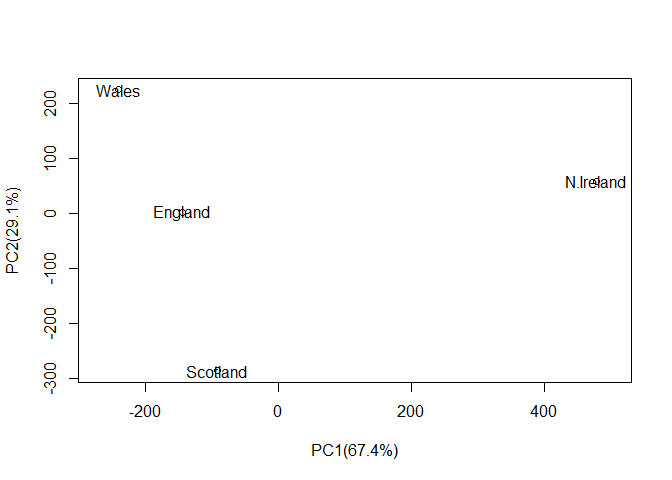<!-- -->

Loading Plot of the data, showing the influence of each category on Ireland

```r
## Lets focus on PC1 as it accounts for > 90% of variance 
par(mar=c(10, 4, 4, 2))
barplot( uk.pca$rotation[,1], las=2 )
```

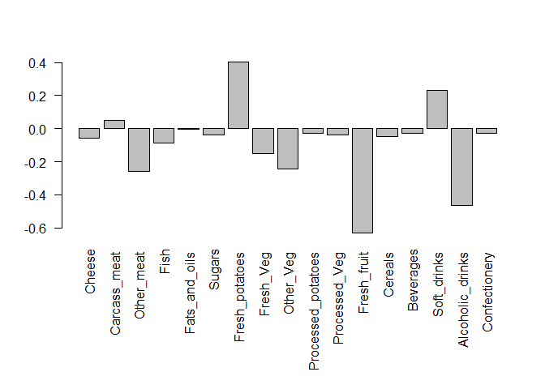<!-- -->

```r
#Biplot of data
biplot(uk.pca)
```

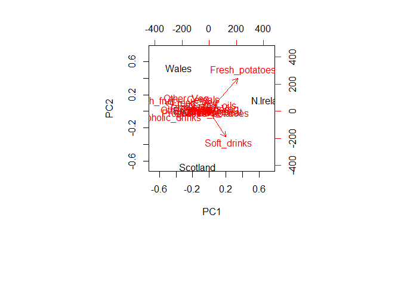<!-- -->

