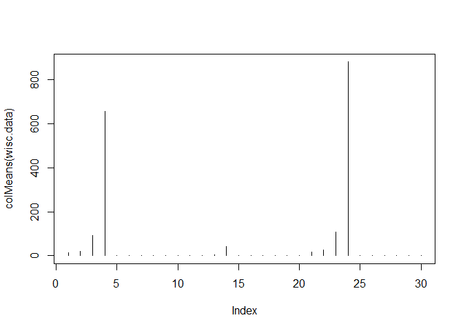

```r
#Importing Data
wisc.df <- read.csv("https://bioboot.github.io/bggn213_S18/class-material/WisconsinCancer.csv")

#Not importing all data. Removing columns 1,2, and 33 b/c columns are non-numeric
##N.B. Column 33 in particular is column "X" of NA values
wisc.data <- as.matrix(wisc.df[,3:32])

#Naming dataset with id's from original data frame
rownames(wisc.data) <- wisc.df$id

diagnosis <- as.numeric(wisc.df$diagnosis == "M")
```


Characterizing dataset

Q1. How many observations are in this dataset?

```r
nrow(wisc.data)
```

```
## [1] 569
```

```r
dim(wisc.data)
```

```
## [1] 569  30
```


Q2. How many variables/features in the data are suffixed with _mean?

```r
grep("_mean", colnames(wisc.data), value = TRUE)
```

```
##  [1] "radius_mean"            "texture_mean"          
##  [3] "perimeter_mean"         "area_mean"             
##  [5] "smoothness_mean"        "compactness_mean"      
##  [7] "concavity_mean"         "concave.points_mean"   
##  [9] "symmetry_mean"          "fractal_dimension_mean"
```

Q3. How many of the observations have a malignant diagnosis?

```r
#212 have malignant diagnosis
table(wisc.df$diagnosis)
```

```
## 
##   B   M 
## 357 212
```

##Section 2

Check to see if data needs to be scaled by checking Mean and Stdev of each column

```r
# Check column means and standard deviations
colMeans(wisc.data)
```

```
##             radius_mean            texture_mean          perimeter_mean 
##            1.412729e+01            1.928965e+01            9.196903e+01 
##               area_mean         smoothness_mean        compactness_mean 
##            6.548891e+02            9.636028e-02            1.043410e-01 
##          concavity_mean     concave.points_mean           symmetry_mean 
##            8.879932e-02            4.891915e-02            1.811619e-01 
##  fractal_dimension_mean               radius_se              texture_se 
##            6.279761e-02            4.051721e-01            1.216853e+00 
##            perimeter_se                 area_se           smoothness_se 
##            2.866059e+00            4.033708e+01            7.040979e-03 
##          compactness_se            concavity_se       concave.points_se 
##            2.547814e-02            3.189372e-02            1.179614e-02 
##             symmetry_se    fractal_dimension_se            radius_worst 
##            2.054230e-02            3.794904e-03            1.626919e+01 
##           texture_worst         perimeter_worst              area_worst 
##            2.567722e+01            1.072612e+02            8.805831e+02 
##        smoothness_worst       compactness_worst         concavity_worst 
##            1.323686e-01            2.542650e-01            2.721885e-01 
##    concave.points_worst          symmetry_worst fractal_dimension_worst 
##            1.146062e-01            2.900756e-01            8.394582e-02
```

```r
#apply() will find the standard deviation of each column
apply(wisc.data,2,sd)
```

```
##             radius_mean            texture_mean          perimeter_mean 
##            3.524049e+00            4.301036e+00            2.429898e+01 
##               area_mean         smoothness_mean        compactness_mean 
##            3.519141e+02            1.406413e-02            5.281276e-02 
##          concavity_mean     concave.points_mean           symmetry_mean 
##            7.971981e-02            3.880284e-02            2.741428e-02 
##  fractal_dimension_mean               radius_se              texture_se 
##            7.060363e-03            2.773127e-01            5.516484e-01 
##            perimeter_se                 area_se           smoothness_se 
##            2.021855e+00            4.549101e+01            3.002518e-03 
##          compactness_se            concavity_se       concave.points_se 
##            1.790818e-02            3.018606e-02            6.170285e-03 
##             symmetry_se    fractal_dimension_se            radius_worst 
##            8.266372e-03            2.646071e-03            4.833242e+00 
##           texture_worst         perimeter_worst              area_worst 
##            6.146258e+00            3.360254e+01            5.693570e+02 
##        smoothness_worst       compactness_worst         concavity_worst 
##            2.283243e-02            1.573365e-01            2.086243e-01 
##    concave.points_worst          symmetry_worst fractal_dimension_worst 
##            6.573234e-02            6.186747e-02            1.806127e-02
```


```r
#type = "h" is a height plot
#Plotting the means of each column
plot(colMeans(wisc.data), type = "h")
```

<!-- -->
The different means have varying magnitudes. i.e. not directly comparable, so data needs to be scaled.

scaling data during PCA

```r
#simple means of scaling by using prcomp
wisc.pr <- prcomp(wisc.data, scale = TRUE)

#error arises. Says that there is a constant column or column of all zeros. From column "X".
#To resolve, remove the column "X" when importing the data.

#Using summary function to inspect the PCA data
summary(wisc.pr)
```

```
## Importance of components:
##                           PC1    PC2     PC3     PC4     PC5     PC6
## Standard deviation     3.6444 2.3857 1.67867 1.40735 1.28403 1.09880
## Proportion of Variance 0.4427 0.1897 0.09393 0.06602 0.05496 0.04025
## Cumulative Proportion  0.4427 0.6324 0.72636 0.79239 0.84734 0.88759
##                            PC7     PC8    PC9    PC10   PC11    PC12
## Standard deviation     0.82172 0.69037 0.6457 0.59219 0.5421 0.51104
## Proportion of Variance 0.02251 0.01589 0.0139 0.01169 0.0098 0.00871
## Cumulative Proportion  0.91010 0.92598 0.9399 0.95157 0.9614 0.97007
##                           PC13    PC14    PC15    PC16    PC17    PC18
## Standard deviation     0.49128 0.39624 0.30681 0.28260 0.24372 0.22939
## Proportion of Variance 0.00805 0.00523 0.00314 0.00266 0.00198 0.00175
## Cumulative Proportion  0.97812 0.98335 0.98649 0.98915 0.99113 0.99288
##                           PC19    PC20   PC21    PC22    PC23   PC24
## Standard deviation     0.22244 0.17652 0.1731 0.16565 0.15602 0.1344
## Proportion of Variance 0.00165 0.00104 0.0010 0.00091 0.00081 0.0006
## Cumulative Proportion  0.99453 0.99557 0.9966 0.99749 0.99830 0.9989
##                           PC25    PC26    PC27    PC28    PC29    PC30
## Standard deviation     0.12442 0.09043 0.08307 0.03987 0.02736 0.01153
## Proportion of Variance 0.00052 0.00027 0.00023 0.00005 0.00002 0.00000
## Cumulative Proportion  0.99942 0.99969 0.99992 0.99997 1.00000 1.00000
```

Q4. From your results, what proportion of the original variance is captured by the first principal components (PC1)?

Q5. How many principal components (PCs) are required to describe at least 70% of the original variance in the data?
From summary, 3 components

Q6. How many principal components (PCs) are required to describe at least 90% of the original variance in the data?


###Plotting the PCA

```r
#diagnosis = 1 or 0, add 1 in col b/c white is col = 0
## Black dots are benign, red are malginant
plot(wisc.pr$x[,1], wisc.pr$x[,2], col = diagnosis+1, xlab = "PC1", ylab = "PC2")
```

<!-- -->

We see that there are groupings of benign tumors, but cancers are variable. However, we know that at least 3 of the principal components are needed to visualize 70% of our data, so we need more plots.

#### Scree-plot of the PCA

```r
#In order to make a scree plot, we need to condense the columns of our PCA to make it appear

#Storing the variance of the PCA by squaring the standard of deviation
wisc.pr.var <- (wisc.pr$sdev^2)

pve <- wisc.pr.var/ sum(wisc.pr.var)

plot(pve, xlab = "Principal Components", ylab = "Proportion of Variance Explained", ylim = c(0,1), type = "o")
```

<!-- -->


```r
#Bar plot of variance

#las = 2 makes data labels vertical
barplot(pve, names.arg = paste0("PC", 1:length(pve)), las = 2, axes = FALSE, xlab = "Principal Component", ylab = "Percent of Variance Explained (%)")

#Adding own axes. Axis 2 = vertical axis
#'at' tells where to put the ticks
#'labels' that are rounded to the 2 digit
axis(2, at=pve, labels=round(pve,2)*100 )
```

<!-- -->
This plot shows how much variance each component explains, but what if we wanted to know how many components we would need to explain a certain % variance? We can us a cumulative sum.


```r
# Plot cumulative proportion of variance explained
plot(cumsum(pve), xlab = "Principal Component", 
     ylab = "Cumulative Proportion of Variance Explained", 
     ylim = c(0, 1), type = "o")
abline(h = 0.7, col = 2)
abline(h = 0.8, col = 3)
```

<!-- -->


```r
#Using par() to make a combined figure
par(mfrow = c(1,2))

#individ contrib.
plot(pve, xlab = "Principal Components", ylab = "Proportion of Variance Explained", ylim = c(0,1), type = "o")
#cumsum
plot(cumsum(pve), xlab = "Principal Component", 
     ylab = "Cumulative Proportion of Variance Explained", 
     ylim = c(0, 1), type = "o")
```

<!-- -->

##Hierarchical Clustering of the Data

```r
# Scale the wisc.data data: data.scaled
data.scaled <- scale(wisc.data)

#Calculating distribution matrix of data
data.dist <- dist(data.scaled)

#Clustering data by hierarchy
wisc.hclust <- hclust(data.dist, method = "complete")
```

Plotting the Hclust

```r
#Plotting
plot(wisc.hclust, col = cutree(wisc.hclust, k = 4))
abline(h = 19, col = "red", lwd = 1)
```

<!-- -->


```r
wisc.hclust.clusters <- cutree(wisc.hclust, k = 4)
```

How do these groups match our diagnostics data? Does the data match the diagnosis from professional doctors?

```r
#shows how many benign and malignant
table(diagnosis)
```

```
## diagnosis
##   0   1 
## 357 212
```

```r
#How many are in each cluster. Cross-tabulation. Shows how many of each cluster are benign = 0 or malignant = 1
table(wisc.hclust.clusters, diagnosis)
```

```
##                     diagnosis
## wisc.hclust.clusters   0   1
##                    1  12 165
##                    2   2   5
##                    3 343  40
##                    4   0   2
```
Results show that the results aren't too horrible. It can Mostly distinguish between clusters 1 and 3. But 4 clusters are too much.

Clustering results in a different way: Kmeans. K-clustering works by relatedness and minimizing the cluster variance.

```r
#Clustering with K-means. Still keeping 4 clusters
wisc.km <- kmeans(data.scaled, centers= 4, nstart= 20)

#wisc.km$cluster is a vector of the cluster each data belongs to
table(wisc.km$cluster, diagnosis)
```

```
##    diagnosis
##       0   1
##   1  36  54
##   2   0  37
##   3 321  24
##   4   0  97
```
Results look cleaner for clusters 1,2, and 3. Although 3 still looks small. The clustering can't distinguish between cases in cluster 4. It's about 50:50 whether its Benign or Malignant. 4 clusters are still too much

Try again with 2 clusters

```r
wisc.km <- kmeans(data.scaled, centers= 2, nstart= 20)
table(wisc.km$cluster, diagnosis)
```

```
##    diagnosis
##       0   1
##   1  14 175
##   2 343  37
```
We see that the model can caputre ~80% accuracy. Which is not that great for all the false-negative ppl that wold go untreated

###Trying to cluster the data based of PCA rather than actual Data

```r
## Use the distance along the first 7 PCs for clustering i.e. wisc.pr$x[, 1:7]
## We're using the 1st 7 columns, b/c 7 PCs will capture 90% of the variance
wisc.pr.hclust <- hclust(dist(wisc.pr$x[,1:7]), method = "ward.D2")

#plotting the clustered PCA
plot(wisc.pr.hclust)
```

<!-- -->

Cross-tabulating the PCA H-cluster. Clustering off the PCA should better describe the observations than the clustering off the raw data set.

```r
#Now to cluster the data into 2 clusters again based off the PCA
wisc.pr.hclust.clusters <- cutree(wisc.pr.hclust, k = 2)

#Cross-tabulating PCA clusters with expert diagnosis
table(wisc.pr.hclust.clusters, diagnosis)
```

```
##                        diagnosis
## wisc.pr.hclust.clusters   0   1
##                       1  28 188
##                       2 329  24
```

Visual comparison of the PCA-Cluster Diagnosis versus original data

```r
par(mfrow = c(2,1))

#original plot with colors based of Diagnosis matrix
plot(wisc.pr$x[,1], wisc.pr$x[,2], col = diagnosis+1, xlab = "PC1", ylab = "PC2")

#Plot of data with colors based of PCA clustering
plot(wisc.pr$x[,1:2], col = wisc.pr.hclust.clusters, xlab = "PC1", ylab = "PC2")
```

<!-- -->

#Predicting Malignancy of New Samples

```r
#import new data
url <-  "https://tinyurl.com/new-samples-CSV"
new <- read.csv(url)

#Use the predict() function to predict the PC scores of the new data based off the PCs of the original data
npc <- predict(wisc.pr, newdata = new)

plot(wisc.pr$x[,1:2], col = wisc.pr.hclust.clusters)
points(npc[,1], npc[,2], col = c("purple","blue"), pch = 16, cex = 1.5)
```

<!-- -->
The model predicts that patient 1 has malignant cancer and patient 2 has benign tumors.

Recording Version Info for Future Reference.

```r
sessionInfo()
```

```
## R version 3.4.4 (2018-03-15)
## Platform: x86_64-w64-mingw32/x64 (64-bit)
## Running under: Windows 10 x64 (build 16299)
## 
## Matrix products: default
## 
## locale:
## [1] LC_COLLATE=English_United States.1252 
## [2] LC_CTYPE=English_United States.1252   
## [3] LC_MONETARY=English_United States.1252
## [4] LC_NUMERIC=C                          
## [5] LC_TIME=English_United States.1252    
## 
## attached base packages:
## [1] stats     graphics  grDevices utils     datasets  methods   base     
## 
## loaded via a namespace (and not attached):
##  [1] compiler_3.4.4  backports_1.1.2 magrittr_1.5    rprojroot_1.3-2
##  [5] tools_3.4.4     htmltools_0.3.6 yaml_2.1.18     Rcpp_0.12.16   
##  [9] stringi_1.1.7   rmarkdown_1.9   knitr_1.20      stringr_1.3.0  
## [13] digest_0.6.15   evaluate_0.10.1
```

