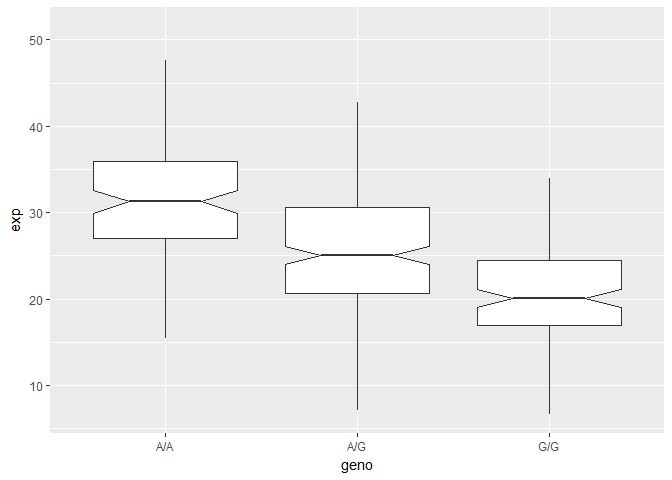

Class 13
================
Gary Le
May 16th, 2018

Loading in 1000 Genomes Project Data
------------------------------------

-   Reading in data from Mexican in Los Angeles population (MXL) of 1000 Genome Projects

``` r
genotype <- read.csv("373531-SampleGenotypes-Homo_sapiens_Variation_Sample_rs8067378.csv")
```

-   Sample should have 64 rows (patients)

``` r
#Table out different genotypes
table(genotype[,2])
```

    ## 
    ## A|A A|G G|A G|G 
    ##  22  21  12   9

``` r
#Percent Frequency of Genotypes
table(genotype[,2]) / nrow(genotype) * 100
```

    ## 
    ##     A|A     A|G     G|A     G|G 
    ## 34.3750 32.8125 18.7500 14.0625

-   Loading Libraries to read sequencing scores from fastqsanger files

``` r
library(seqinr)
library(gtools)

#test values
phred <- asc( s2c("DDDDCDEDCDDDDBBDDDCC@") ) - 33
phred 
```

    ##  D  D  D  D  C  D  E  D  C  D  D  D  D  B  B  D  D  D  C  C  @ 
    ## 35 35 35 35 34 35 36 35 34 35 35 35 35 33 33 35 35 35 34 34 31

Analyzing Population Scale genomics data
----------------------------------------

-   Reading in and summarizing population data for SNP

``` r
pop <- read.table("https://bioboot.github.io/bggn213_S18/class-material/
rs8067378_ENSG00000172057.6.txt")

summary(pop)
```

    ##      sample     geno          exp        
    ##  HG00096:  1   A/A:108   Min.   : 6.675  
    ##  HG00097:  1   A/G:233   1st Qu.:20.004  
    ##  HG00099:  1   G/G:121   Median :25.116  
    ##  HG00100:  1             Mean   :25.640  
    ##  HG00101:  1             3rd Qu.:30.779  
    ##  HG00102:  1             Max.   :51.518  
    ##  (Other):456

``` r
boxplot(pop)
```


-   Checking expression value of samples with G|G homozygous and other genotypes
    -   Shows that A|A genotype has the highest expression followed by heterozygous

``` r
summary(pop$exp[ pop$geno == "A/A"])
```

    ##    Min. 1st Qu.  Median    Mean 3rd Qu.    Max. 
    ##   11.40   27.02   31.25   31.82   35.92   51.52

``` r
summary(pop$exp[ pop$geno == "A/G"])
```

    ##    Min. 1st Qu.  Median    Mean 3rd Qu.    Max. 
    ##   7.075  20.626  25.065  25.397  30.552  48.034

``` r
summary(pop$exp[ pop$geno == "G/G"])
```

    ##    Min. 1st Qu.  Median    Mean 3rd Qu.    Max. 
    ##   6.675  16.903  20.074  20.594  24.457  33.956

``` r
#Box plots of expression by genotype (exp ~ geno) from the population data.
pop.box <- boxplot(exp ~ geno, data = pop, notch = TRUE)
```


-   Fancy version of boxplot by ggplot2

``` r
#install.packages("ggplot2")
# N.B. ggplot only takes data frames
library("ggplot2")

#Customize graph aesthetic by modifying the aes() arguments.
# N.B. aes() takes the input in the form of (factor,data)
# N.B. the + geom_foo() tells ggplot which type of geometry our plot should have
ggplot(pop, aes(geno,exp)) + 
  geom_boxplot(notch = TRUE, outlier.shape = NA)
```



``` r
sessionInfo()
```

    ## R version 3.4.4 (2018-03-15)
    ## Platform: x86_64-w64-mingw32/x64 (64-bit)
    ## Running under: Windows 10 x64 (build 16299)
    ## 
    ## Matrix products: default
    ## 
    ## locale:
    ## [1] LC_COLLATE=English_United States.1252 
    ## [2] LC_CTYPE=English_United States.1252   
    ## [3] LC_MONETARY=English_United States.1252
    ## [4] LC_NUMERIC=C                          
    ## [5] LC_TIME=English_United States.1252    
    ## 
    ## attached base packages:
    ## [1] stats     graphics  grDevices utils     datasets  methods   base     
    ## 
    ## other attached packages:
    ## [1] ggplot2_2.2.1 gtools_3.5.0  seqinr_3.4-5 
    ## 
    ## loaded via a namespace (and not attached):
    ##  [1] Rcpp_0.12.16     knitr_1.20       magrittr_1.5     MASS_7.3-49     
    ##  [5] munsell_0.4.3    colorspace_1.3-2 rlang_0.2.0      stringr_1.3.0   
    ##  [9] plyr_1.8.4       tools_3.4.4      grid_3.4.4       gtable_0.2.0    
    ## [13] htmltools_0.3.6  yaml_2.1.18      ade4_1.7-11      lazyeval_0.2.1  
    ## [17] rprojroot_1.3-2  digest_0.6.15    tibble_1.4.2     evaluate_0.10.1 
    ## [21] rmarkdown_1.9    labeling_0.3     stringi_1.1.7    pillar_1.2.2    
    ## [25] compiler_3.4.4   scales_0.5.0     backports_1.1.2
