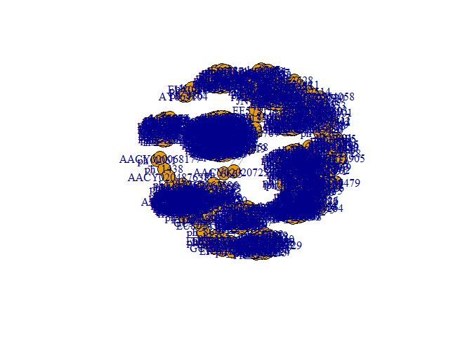
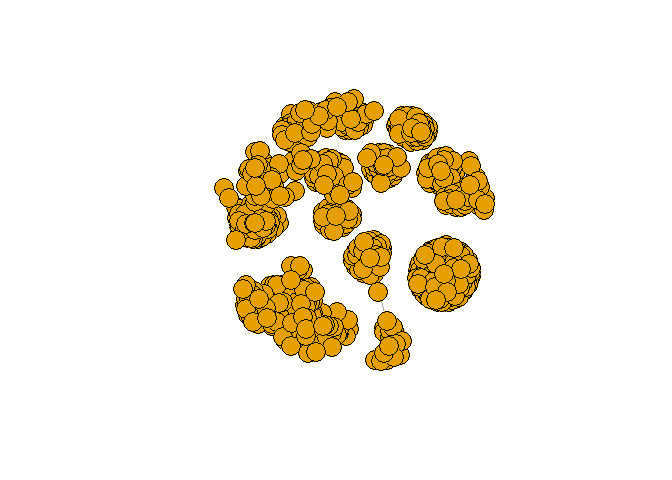
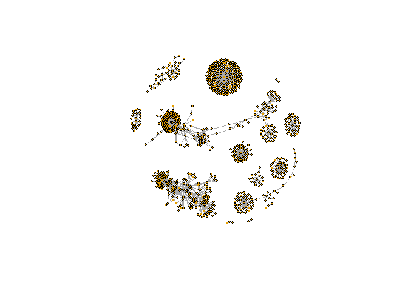
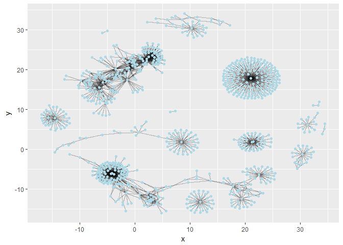
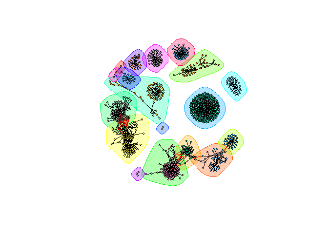
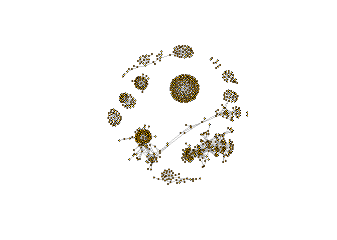
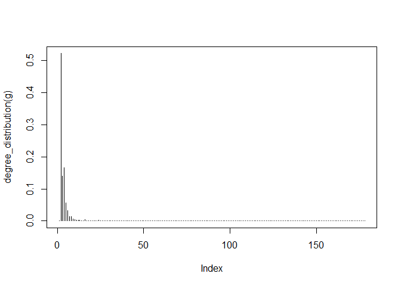
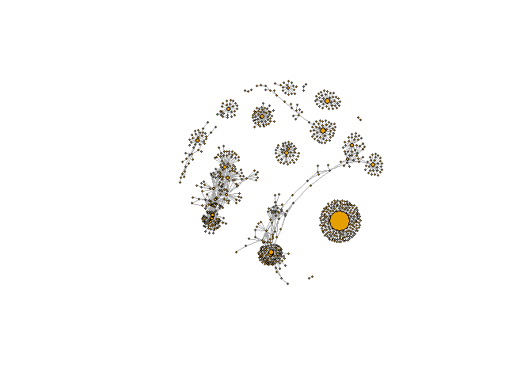
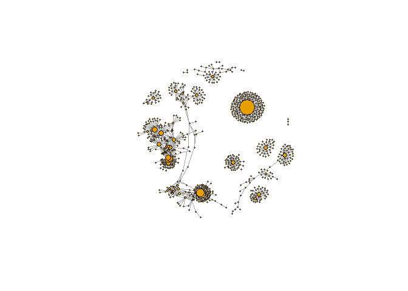
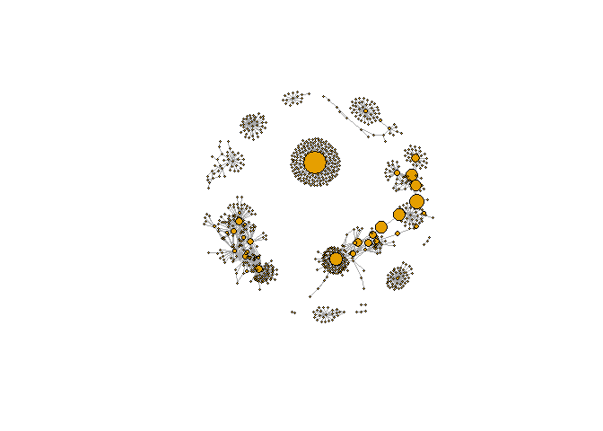

Class 17
================
Gary Le

-   Loading Cytoscape 3 and testing connection.

``` r
library(RCy3)
library(igraph)
```

    ## 
    ## Attaching package: 'igraph'

    ## The following objects are masked from 'package:stats':
    ## 
    ##     decompose, spectrum

    ## The following object is masked from 'package:base':
    ## 
    ##     union

``` r
library(RColorBrewer)

cytoscapePing()
```

    ## [1] "You are connected to Cytoscape!"

``` r
cytoscapeVersionInfo()
```

    ##       apiVersion cytoscapeVersion 
    ##             "v1"          "3.6.1"

-   Importing sample data for network

``` r
#Loading data from link
prok_vir_cor <- read.delim("https://bioboot.github.io/bggn213_S18/class-material/virus_prok_cor_abundant.tsv", stringsAsFactors = FALSE)

#Verifying head
head(prok_vir_cor)
```

    ##       Var1          Var2    weight
    ## 1  ph_1061 AACY020068177 0.8555342
    ## 2  ph_1258 AACY020207233 0.8055750
    ## 3  ph_3164 AACY020207233 0.8122517
    ## 4  ph_1033 AACY020255495 0.8487498
    ## 5 ph_10996 AACY020255495 0.8734617
    ## 6 ph_11038 AACY020255495 0.8740782

-   Set data frame for graph

``` r
g <- graph.data.frame(prok_vir_cor, directed = FALSE)

# N.B. igraph needs to be loaded
class(g)
```

    ## [1] "igraph"

``` r
g
```

    ## IGRAPH 3b7cc60 UNW- 845 1544 -- 
    ## + attr: name (v/c), weight (e/n)
    ## + edges from 3b7cc60 (vertex names):
    ##  [1] ph_1061 --AACY020068177 ph_1258 --AACY020207233
    ##  [3] ph_3164 --AACY020207233 ph_1033 --AACY020255495
    ##  [5] ph_10996--AACY020255495 ph_11038--AACY020255495
    ##  [7] ph_11040--AACY020255495 ph_11048--AACY020255495
    ##  [9] ph_11096--AACY020255495 ph_1113 --AACY020255495
    ## [11] ph_1208 --AACY020255495 ph_13207--AACY020255495
    ## [13] ph_1346 --AACY020255495 ph_14679--AACY020255495
    ## [15] ph_1572 --AACY020255495 ph_16045--AACY020255495
    ## + ... omitted several edges

``` r
# N.B. "UNW- 845 1544" means that the graph has 854 nodes, 1544 edges and is an Undirected, Named, and Weighted graph 
```

``` r
plot(g)
```



``` r
# "This is a hot-mess! Lets turn of the blue text labels"
# - Dr. Grant
```

``` r
plot(g, vertex.label=NA)
```



``` r
# Still cheese balls.
```

``` r
plot(g, vertex.size=3, vertex.label=NA)
```



-   Optionally, graph with ggplot

``` r
library('ggraph')
```

    ## Loading required package: ggplot2

``` r
ggraph(g, layout = 'auto') +
  geom_edge_link(alpha = 0.25) +
  geom_node_point(color="lightblue")
```

    ## Using `nicely` as default layout



-   Accessing vertex and edge data with V() and E() respectively

``` r
V(g)
```

    ## + 845/845 vertices, named, from 3b7cc60:
    ##   [1] ph_1061       ph_1258       ph_3164       ph_1033       ph_10996     
    ##   [6] ph_11038      ph_11040      ph_11048      ph_11096      ph_1113      
    ##  [11] ph_1208       ph_13207      ph_1346       ph_14679      ph_1572      
    ##  [16] ph_16045      ph_1909       ph_1918       ph_19894      ph_2117      
    ##  [21] ph_2231       ph_2363       ph_276        ph_2775       ph_2798      
    ##  [26] ph_3217       ph_3336       ph_3493       ph_3541       ph_3892      
    ##  [31] ph_4194       ph_4602       ph_4678       ph_484        ph_4993      
    ##  [36] ph_4999       ph_5001       ph_5010       ph_5286       ph_5287      
    ##  [41] ph_5302       ph_5321       ph_5643       ph_6441       ph_654       
    ##  [46] ph_6954       ph_7389       ph_7920       ph_8039       ph_8695      
    ## + ... omitted several vertices

``` r
E(g)
```

    ## + 1544/1544 edges from 3b7cc60 (vertex names):
    ##  [1] ph_1061 --AACY020068177 ph_1258 --AACY020207233
    ##  [3] ph_3164 --AACY020207233 ph_1033 --AACY020255495
    ##  [5] ph_10996--AACY020255495 ph_11038--AACY020255495
    ##  [7] ph_11040--AACY020255495 ph_11048--AACY020255495
    ##  [9] ph_11096--AACY020255495 ph_1113 --AACY020255495
    ## [11] ph_1208 --AACY020255495 ph_13207--AACY020255495
    ## [13] ph_1346 --AACY020255495 ph_14679--AACY020255495
    ## [15] ph_1572 --AACY020255495 ph_16045--AACY020255495
    ## [17] ph_1909 --AACY020255495 ph_1918 --AACY020255495
    ## [19] ph_19894--AACY020255495 ph_2117 --AACY020255495
    ## + ... omitted several edges

-   Detecting communities by measuring betweenness

``` r
cb <- cluster_edge_betweenness(g) #Default is Girvan-Newman method
```

    ## Warning in cluster_edge_betweenness(g): At community.c:460 :Membership
    ## vector will be selected based on the lowest modularity score.

    ## Warning in cluster_edge_betweenness(g): At community.c:467 :Modularity
    ## calculation with weighted edge betweenness community detection might not
    ## make sense -- modularity treats edge weights as similarities while edge
    ## betwenness treats them as distances

``` r
cb
```

    ## IGRAPH clustering edge betweenness, groups: 18, mod: 0.82
    ## + groups:
    ##   $`1`
    ##   [1] "ph_1061"       "AACY020068177"
    ##   
    ##   $`2`
    ##    [1] "ph_1258"       "ph_5861"       "ph_7172"       "ph_11569"     
    ##    [5] "ph_1291"       "ph_1600"       "ph_2702"       "ph_5790"      
    ##    [9] "ph_5858"       "ph_7594"       "ph_7816"       "ph_784"       
    ##   [13] "ph_1359"       "ph_1534"       "ph_1874"       "ph_2465"      
    ##   [17] "ph_5453"       "ph_900"        "ph_908"        "ph_811"       
    ##   [21] "ph_1367"       "ph_1452"       "ph_1458"       "ph_1723"      
    ##   + ... omitted several groups/vertices

-   Mapping communities onto network

``` r
plot(cb, y=g, vertex.label=NA,  vertex.size=3)
```



``` r
# Original plot for comparison
plot(g, vertex.size=3, vertex.label=NA)
```



-   membership() can be used to see which community each node is apart of

``` r
head( membership(cb) )
```

    ##  ph_1061  ph_1258  ph_3164  ph_1033 ph_10996 ph_11038 
    ##        1        2        3        4        4        4

-   Other useful functions are to see the degrees in the network

``` r
# Calculate and plot node degree of our network
d <- degree(g)
hist(d, breaks=30, col="lightblue", main ="Node Degree Distribution")
```

 \* As we can see, the histogram looks like a a scale-free network.

``` r
plot( degree_distribution(g), type="h" )
```



\*Now, we can take a look at centrality. This helps gauge the importantness of a node. Even Google uses it! We'll be using the Google PageRank method

``` r
pr <- page_rank(g)
head(pr$vector)
```

    ##      ph_1061      ph_1258      ph_3164      ph_1033     ph_10996 
    ## 0.0011834320 0.0011599483 0.0019042088 0.0005788564 0.0005769663 
    ##     ph_11038 
    ## 0.0005745460

-   Visualizing graph based on importance of nodes by centrality

``` r
# Make a size vector btwn 2 and 20 for node plotting size
library('BBmisc')
```

    ## 
    ## Attaching package: 'BBmisc'

    ## The following object is masked from 'package:igraph':
    ## 
    ##     normalize

    ## The following object is masked from 'package:base':
    ## 
    ##     isFALSE

``` r
v.size <- BBmisc::normalize(pr$vector, range=c(2,20), method="range")

# Plotting with vertex size
plot(g, vertex.size=v.size, vertex.label=NA)
```



-   We can also visualize centrality with the easier metric of degrees each node has.

``` r
# Setting vertex size on a distribution of [2,20] based off degrees
v.size <- BBmisc::normalize(d, range=c(2,20), method="range")

plot(g, vertex.size=v.size, vertex.label=NA)
```



``` r
# Notice how some nodes change in importance/size while others don't
```

-   A little more complex method is to use betweenness which, roughly, divides the shortest paths through a node by its edges.

``` r
# Another useful and aptly named function.
b <- betweenness(g)
v.size <- BBmisc::normalize(b, range=c(2,20), method="range")

plot(g, vertex.size=v.size, vertex.label=NA)
```



``` r
# Note the drastic increase in size of the path linking the two neighborhoods on the right of the graph
```

### Annotating Network with Taxonomical Information

``` r
# Loading in phage id data
phage_id_affiliation <- read.delim("https://bioboot.github.io/bggn213_S18/class-material/phage_ids_with_affiliation.tsv")
head(phage_id_affiliation)
```

    ##   first_sheet.Phage_id first_sheet.Phage_id_network phage_affiliation
    ## 1        109DCM_115804                       ph_775              <NA>
    ## 2        109DCM_115804                       ph_775              <NA>
    ## 3        109DCM_115804                       ph_775              <NA>
    ## 4        109DCM_115804                       ph_775              <NA>
    ## 5        109DCM_115804                       ph_775              <NA>
    ## 6        109DCM_115804                       ph_775              <NA>
    ##   Domain DNA_or_RNA Tax_order Tax_subfamily Tax_family Tax_genus
    ## 1   <NA>       <NA>      <NA>          <NA>       <NA>      <NA>
    ## 2   <NA>       <NA>      <NA>          <NA>       <NA>      <NA>
    ## 3   <NA>       <NA>      <NA>          <NA>       <NA>      <NA>
    ## 4   <NA>       <NA>      <NA>          <NA>       <NA>      <NA>
    ## 5   <NA>       <NA>      <NA>          <NA>       <NA>      <NA>
    ## 6   <NA>       <NA>      <NA>          <NA>       <NA>      <NA>
    ##   Tax_species
    ## 1        <NA>
    ## 2        <NA>
    ## 3        <NA>
    ## 4        <NA>
    ## 5        <NA>
    ## 6        <NA>

``` r
# Loading in bacterial id data from SILVA DB
bac_id_affi <- read.delim("https://bioboot.github.io/bggn213_S18/class-material/prok_tax_from_silva.tsv", stringsAsFactors = FALSE)
head(bac_id_affi)
```

    ##    Accession_ID  Kingdom         Phylum          Class             Order
    ## 1 AACY020068177 Bacteria    Chloroflexi   SAR202 clade marine metagenome
    ## 2 AACY020125842  Archaea  Euryarchaeota Thermoplasmata Thermoplasmatales
    ## 3 AACY020187844  Archaea  Euryarchaeota Thermoplasmata Thermoplasmatales
    ## 4 AACY020105546 Bacteria Actinobacteria Actinobacteria             PeM15
    ## 5 AACY020281370  Archaea  Euryarchaeota Thermoplasmata Thermoplasmatales
    ## 6 AACY020147130  Archaea  Euryarchaeota Thermoplasmata Thermoplasmatales
    ##              Family             Genus Species
    ## 1              <NA>              <NA>    <NA>
    ## 2   Marine Group II marine metagenome    <NA>
    ## 3   Marine Group II marine metagenome    <NA>
    ## 4 marine metagenome              <NA>    <NA>
    ## 5   Marine Group II marine metagenome    <NA>
    ## 6   Marine Group II marine metagenome    <NA>

-   Preparingnetwork for Cytoscape Visualization

``` r
# Extract out our vertex names
## The gene names are stored as the vertex attributes (this set only has names)
genenet.nodes <- as.data.frame(vertex.attributes(g), stringsAsFactors=FALSE)

head(genenet.nodes)
```

    ##       name
    ## 1  ph_1061
    ## 2  ph_1258
    ## 3  ph_3164
    ## 4  ph_1033
    ## 5 ph_10996
    ## 6 ph_11038

``` r
# Using grep to see how many phage nodes we have (Nodes that start with "ph_")
length( grep("^ph_",genenet.nodes[,1]) )
```

    ## [1] 764

``` r
## 764 Phage nodes
## 81 non-phage nodes
```

``` r
# Merging different columns to make a classification table

# We dont need all annotation data so lets make a reduced table 'z' for merging
z <- bac_id_affi[,c("Accession_ID", "Kingdom", "Phylum", "Class")]

# Our final, merged table with 
n <- merge(genenet.nodes, z, by.x="name", by.y="Accession_ID", all.x=TRUE)
head(n)
```

    ##            name  Kingdom          Phylum               Class
    ## 1 AACY020068177 Bacteria     Chloroflexi        SAR202 clade
    ## 2 AACY020207233 Bacteria Deferribacteres     Deferribacteres
    ## 3 AACY020255495 Bacteria  Proteobacteria Gammaproteobacteria
    ## 4 AACY020288370 Bacteria  Actinobacteria      Acidimicrobiia
    ## 5 AACY020396101 Bacteria  Actinobacteria      Acidimicrobiia
    ## 6 AACY020398456 Bacteria  Proteobacteria Gammaproteobacteria

    + All the Bacteria should be properly labeled now.

    + Moving onto the more complicated phage IDs

``` r
# Check on the column names before deciding what to merge i.e. what we have/need to use
colnames(n)
```

    ## [1] "name"    "Kingdom" "Phylum"  "Class"

``` r
# We only want the phages that match
colnames(phage_id_affiliation)
```

    ##  [1] "first_sheet.Phage_id"         "first_sheet.Phage_id_network"
    ##  [3] "phage_affiliation"            "Domain"                      
    ##  [5] "DNA_or_RNA"                   "Tax_order"                   
    ##  [7] "Tax_subfamily"                "Tax_family"                  
    ##  [9] "Tax_genus"                    "Tax_species"

``` r
# Again we only need a subset of `phage_id_affiliation` for our purposes
y <- phage_id_affiliation[, c("first_sheet.Phage_id_network", "phage_affiliation","Tax_order", "Tax_subfamily")]

# Add the little phage annotation that we have
x <- merge(x=n, y=y, by.x="name", by.y="first_sheet.Phage_id_network", all.x=TRUE)

## Remove duplicates from multiple matches
x <- x[!duplicated( (x$name) ),]
head(x)
```

    ##            name  Kingdom          Phylum               Class
    ## 1 AACY020068177 Bacteria     Chloroflexi        SAR202 clade
    ## 2 AACY020207233 Bacteria Deferribacteres     Deferribacteres
    ## 3 AACY020255495 Bacteria  Proteobacteria Gammaproteobacteria
    ## 4 AACY020288370 Bacteria  Actinobacteria      Acidimicrobiia
    ## 5 AACY020396101 Bacteria  Actinobacteria      Acidimicrobiia
    ## 6 AACY020398456 Bacteria  Proteobacteria Gammaproteobacteria
    ##   phage_affiliation Tax_order Tax_subfamily
    ## 1              <NA>      <NA>          <NA>
    ## 2              <NA>      <NA>          <NA>
    ## 3              <NA>      <NA>          <NA>
    ## 4              <NA>      <NA>          <NA>
    ## 5              <NA>      <NA>          <NA>
    ## 6              <NA>      <NA>          <NA>

``` r
# Storing our node data
genenet.nodes <- x
```

-   Final preparations for Cytoscape

``` r
# Adding edge data from our graph "g""
genenet.edges <- data.frame(igraph::as_edgelist(g))
names(genenet.edges) <- c("source",
                          "target")

# Adding the edge weights which are just another edge attribute
genenet.edges$Weight <- igraph::edge_attr(g)[[1]]

# Adding the proper names; strictly specifiying type as character
genenet.edges$source <- as.character(genenet.edges$source)
genenet.edges$target <- as.character(genenet.edges$target)
genenet.nodes$id <- as.character(genenet.nodes$name)

# Final plot for Cytoscape. Takes a simple list of nodes and edges
## N.B. RCy3 has been updated and cyPlot() is now a defunct fxn
## Use this method instead to create Cytoscape Windos (cw)
### The method takes data frames as inputs
cw <- createNetworkFromDataFrames(nodes = as.data.frame(genenet.nodes), 
                                  edges = as.data.frame(genenet.edges), 
                                  title = "Tara Oceans")
```

    ## Loading data...
    ## Applying default style...
    ## Applying preferred layout...

-   Coloring the graph

``` r
# N.B. English use of 'colour' vs 'color' b/c Dr. Grant is Irish
families_to_colour <- unique(genenet.nodes$Phylum)
families_to_colour <- families_to_colour[!is.na(families_to_colour)]

node.colour <- RColorBrewer::brewer.pal(length(families_to_colour), "Set3")

# Setting more color rules
setNodeColorMapping("Phylum",
                 families_to_colour,
                 node.colour,
                 "lookup",
                 default.color = "#ffffff")
```

-   Saving Image

``` r
# exportImage(filename="net2",
#           type="png",
#           h=350)

#Access Denied error in commandsPOST
```
